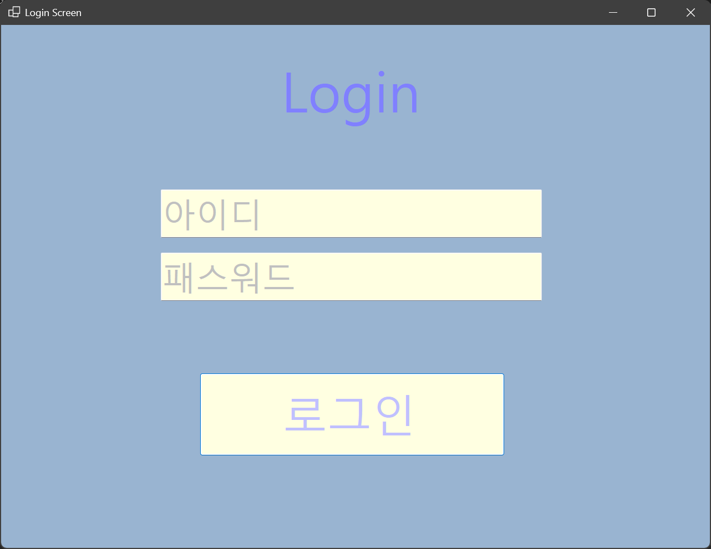
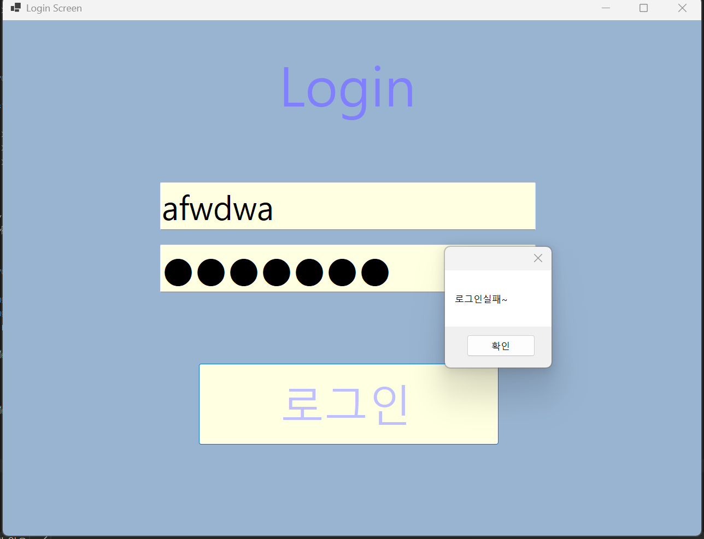
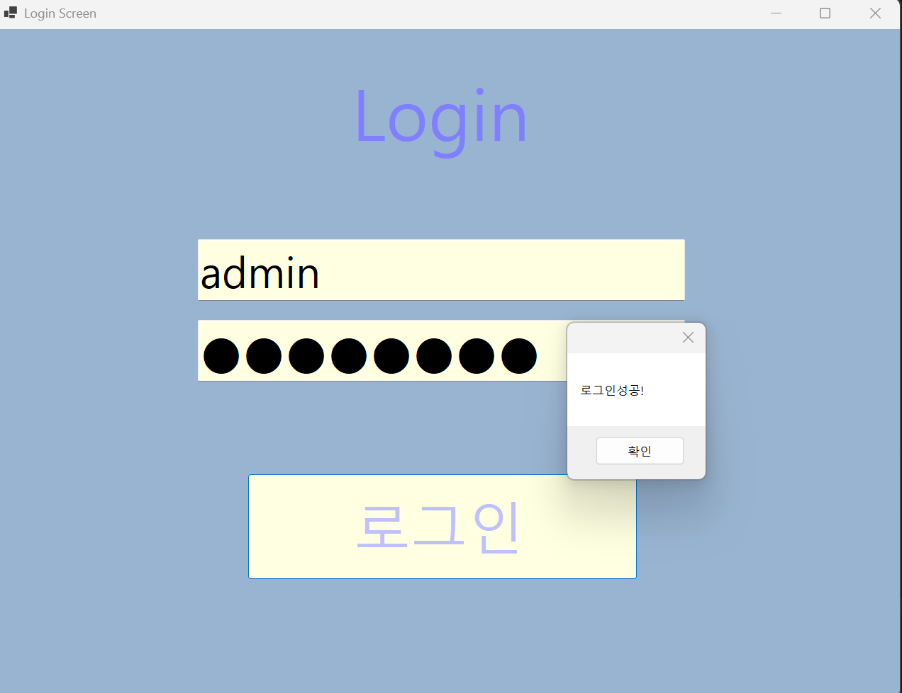
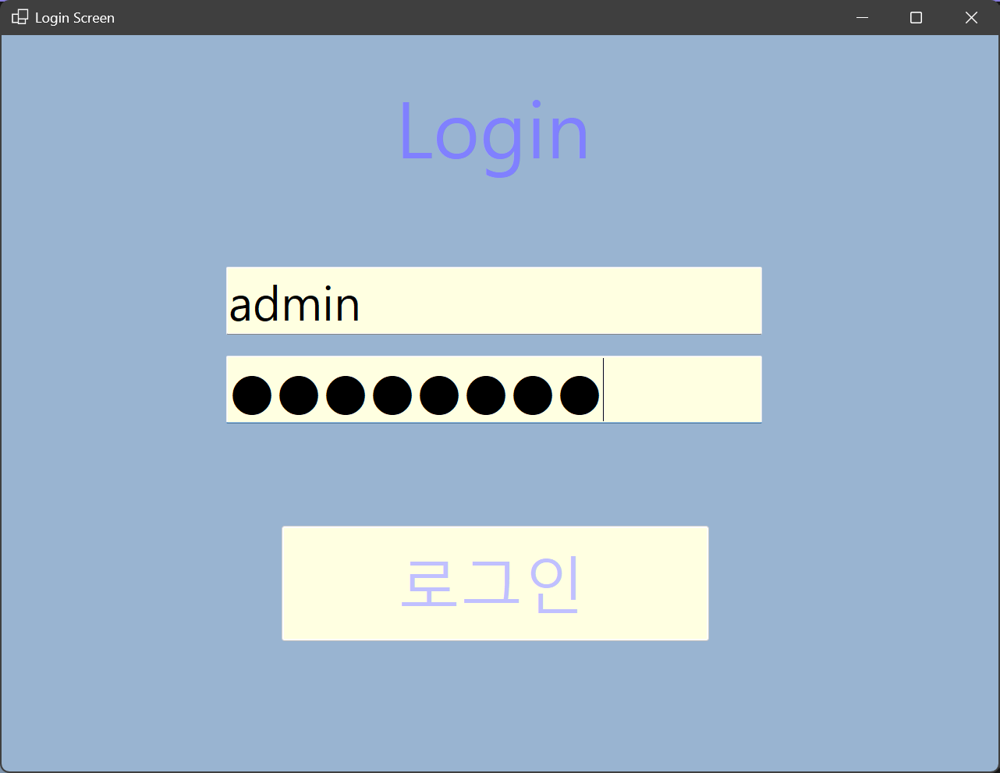
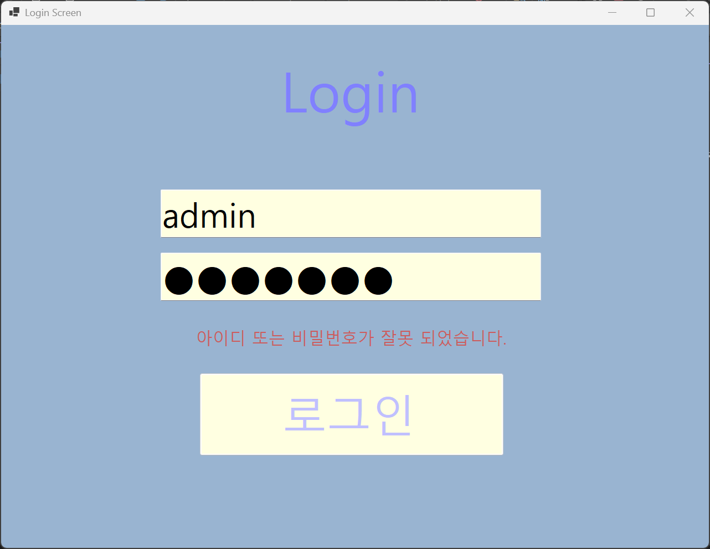
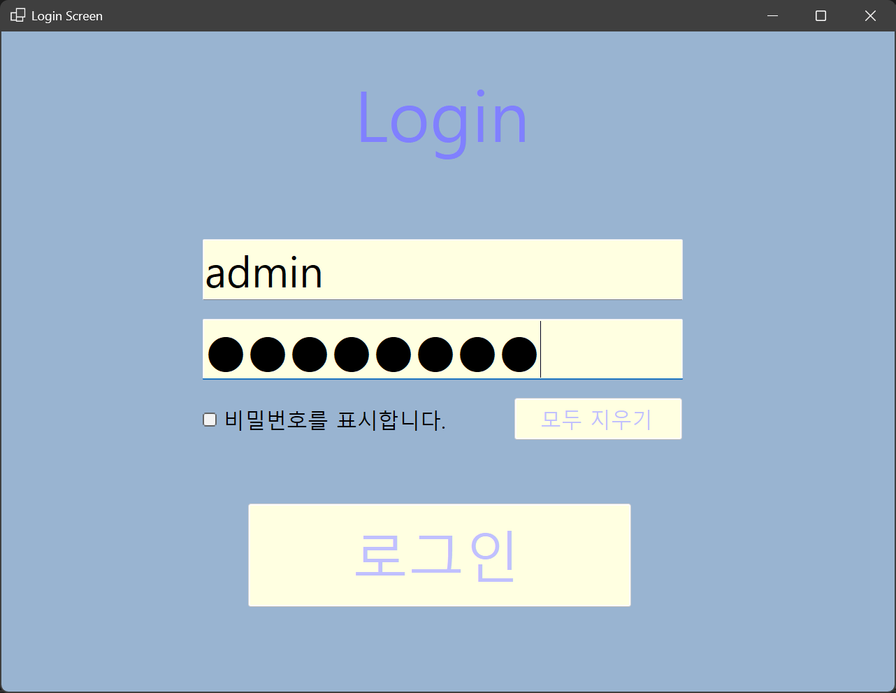
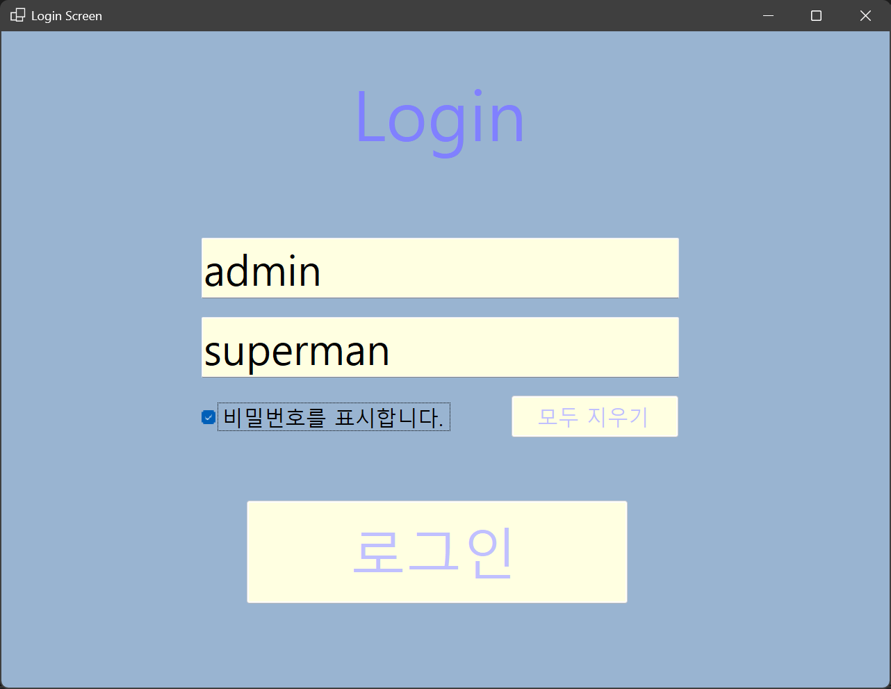
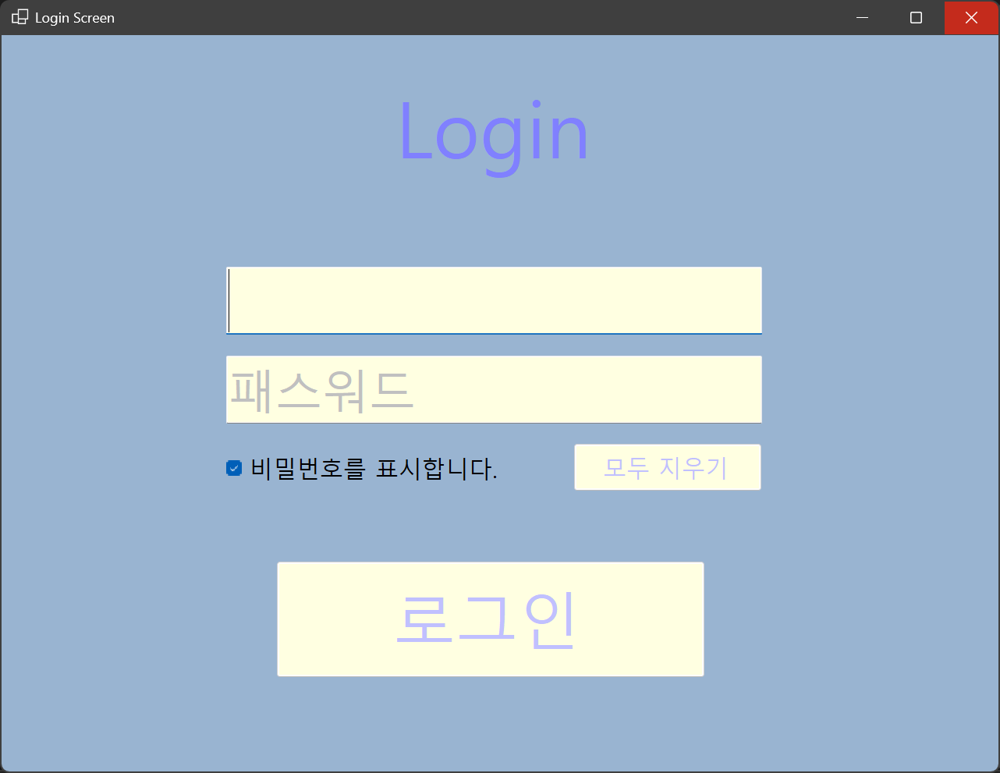

# (C# 코딩) 로그인 스크린

## 개요
- C# 프로그래밍 학습
- 1줄 소개: 사용자로부터 아이디와 패스워드를 입력받아 검증하고, 다양한 UX 편의 기능과 로그인 실패 횟수 제한 등의 보안을 제공하는 로그인 프로그램
- 사용한 플랫폼: C#, .NET Windows Forms, Visual Studio, GitHub
- 사용한 컨트롤: Label, TextBox, Button, CheckBox
- 사용한 기술과 구현한 기능:
  - Visual Studio를 이용하여 UI 디자인
  - string 클래스와 if~else 조건문, 논리연산자(&&)를 활용한 사용자 인증 로직 처리
  - TextBox의 Enter, Leave 이벤트를 활용한 Placeholder(입력 힌트 텍스트) 시각적 구현
  - Label의 Visible 속성을 제어하여 에러 상황에 맞는 메시지를 팝업 없이 즉각 화면에 출력
  - KeyDown 이벤트를 활용한 Enter 키 네비게이션 제어(Focus) 및 버튼 동작(PerformClick) 구현
  - 변수를 활용한 로그인 시도 횟수 제한 및 Enabled 속성을 이용한 컨트롤 활성/비활성 제어

## 실행 화면 (과제1)
과제1 코드의 실행 스크린샷

- **과제 내용:**
  - TextBox(아이디, 패스워드), Button(로그인) 등을 적절히 배치합니다.
  - 아이디와 패스워드 입력 힌트를 회색으로 표시합니다(Placeholder).
  - 아이디와 패스워드가 모두 맞아야 로그인을 허용하며, 성공/실패 여부를 메시지 박스로 보여줍니다.
- **구현 내용과 기능 설명:**
  - 입력창을 클릭(포커스)하면 힌트 텍스트가 사라지고, 아무것도 입력하지 않고 다른 곳을 클릭하면 다시 힌트가 나타납니다.
  - 올바른 정보 입력 시 로그인 성공 메시지 박스가, 틀린 정보 입력 시 실패 메시지 박스가 나타납니다. 비밀번호 입력 시 문자는 `●` 기호로 마스킹 처리됩니다.

  ## 실행 화면 (과제2)
과제2 코드의 실행 스크린샷

- **과제 내용:**
  - 에러 발생 시 MessageBox를 띄우지 말고 아이디와 패스워드를 입력하는 폼 화면에 보여줍니다.
  - Label 컨트롤과 Visible 속성을 활용하여 메시지 보이기/숨기기 기능을 구현합니다.
- **구현 내용과 기능 설명:**
  - 로그인 실패 시 매번 확인을 눌러야 하는 팝업창을 띄우는 대신, 입력 폼 하단에 빨간색 경고 문구(Label)가 나타나도록 수정했습니다. 로그인에 성공하면 해당 에러 메시지는 다시 숨김 처리됩니다.

## 실행 화면 (과제3)
과제3 코드의 실행 스크린샷

- **과제 내용:**
  - Enter키를 치면 다음 입력 창으로 넘어가거나 곧바로 로그인 되도록 포커스 흐름을 정리합니다.
  - 전체 입력을 지우는 기능과 패스워드를 보여주는 편리한 UI/UX를 구현합니다.
- **구현 내용과 기능 설명:**
  - 아이디 입력 후 키보드 Enter를 누르면 비밀번호 창으로, 비밀번호 창에서 Enter를 누르면 로그인 버튼이 클릭되도록 구현하여 마우스 없이도 빠른 로그인이 가능합니다.
  - '비밀번호 표시' 체크박스를 눌러 가려진 암호를 확인할 수 있고, '초기화' 버튼을 통해 텍스트 필드와 에러 메시지를 처음 상태로 리셋할 수 있습니다.

## 실행 화면 (과제3)
- 과제3: UX 개선 (Enter키 포커스 이동, 초기화, 비밀번호 보기)

**구현 내용과 기능 설명**
마우스 클릭 없이 키보드 Enter키만으로 아이디 -> 패스워드 -> 로그인까지 연속 진행이 가능하여 사용자 편의성이 크게 향상되었습니다. 체크박스를 통해 마스킹된 비밀번호를 확인할 수 있으며, 초기화 버튼으로 텍스트박스와 에러 메시지를 기본 상태로 되돌립니다.

